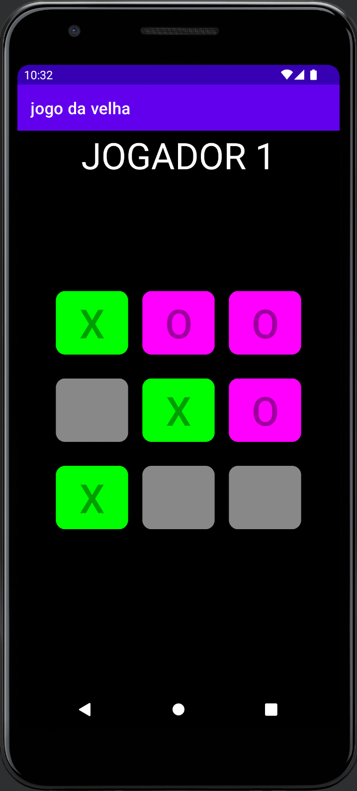

  
   
  <h1>JOGO DA VELHA</h1>
   
    <h4>
  Jogo da velha feito em Kotlin
  </strong>
  </h4>
   

  <h2>Requisitos</h2>
   
  <ul align="left">
    <li>android studio</li>
  </ul>
   

<h2>Tecnologias :rocket: </h2>
 

- [android](https://developer.android.com/?hl=pt)

 
 

---

### Nome dos participantes

- Lucas Aguiar  
   
  Made with ♥ by Lucas Aguiar :wave: [Get in touch!](https://www.linkedin.com/in/lucasaguiiar)
